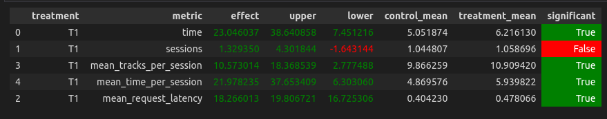

# Идея
Основная концепция: переключаемся на другой рекоммендер, когда песня пользователю не понравилась. Исследовал наиболее хорошую функцию, которая решает о переключении на другой рекоммендер.
# Подробно
1. Переключаемся на `Indexed` рекоммендер (с другими пробовал, этот самый лучший). Помимо прочего не выдаем прослушанные треки.
2. Когда просим новый рекоммендер выдать песню? Рассмотрим несколько функций, в зависимости от времени `t` прослушивания предыдущего трека:
- $t < x$, где $x \sim U[0,1] $
- $t^2 < x$, где $x \sim U[0,1] $
- $t^3 < x$, где $x \sim U[0,1] $
- $t < 0.8$ (обычный трешолд)
- $t^{0.5}<x$, где $x \sim U[0,1] $
- $t^{0.25}<x$, где $x \sim U[0,1] $

Все эти функции хороши тем, что при  $t=0$ однозначно ответ `True` (переключайся на другой рекоммендер), а при $t=1$ `False` (оставайся). 

Изначально я полагал, что идти в сторону увелечения степени $t$ будет хорошей стратегией (размышления строились на основе того, что вряд ли хорошую песню пользователь станет переключать). Однако в реальности оказалось иначе, при равных условиях ТОП по effect выглядил так:
- $t^{0.5}<x$, где $x \sim U[0,1] $
- $t^{0.25}<x$, где $x \sim U[0,1] $
- $t < 0.8$ (обычный трешолд)
- $t < x$, где $x \sim U[0,1] $
- $t^2 < x$, где $x \sim U[0,1] $
- $t^3 < x$, где $x \sim U[0,1] $

Но увидев результат это легко объясняется:) при большой степени t мы вообще чуть ли ни всегда, когда трек прослушал полностью уходим с контекста, что чуть ли не превращает нас в обычный `Indexed`.

Вероятнее всего около степени 0.5 пик этой штуки. 

А результаты с функцией решения
- $t^{0.5}<x$, где $x \sim U[0,1] $

выглядят так:

# Запуск
Ровно такой же как на семинарах:
- запуск докера
- запуск симулятора (я запускад одним процессом на 1000 раз)
- сбор логов
- запуск ноутбука с первого семинара

Если хочется посмотреть, как работают остальные функции - их реализация тоже лежит в папке `recommenders`. 